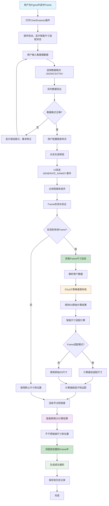

# 📊 ChartDreamer - Figma 数据可视化插件

**ChartDreamer** 是一款功能强大、简单易用的 Figma 数据可视化插件，旨在帮助设计师、产品经理和数据分析师在 Figma 中轻松创建专业、美观的数据图表。

项目首期实现了**桑基图 (Sankey Diagram)** 生成器，未来将支持更多图表类型。

**技术栈**: `Preact` + `TypeScript` + `D3.js` + `create-figma-plugin`

**智能尺寸适配技术特点**:
- **Frame检测**: 使用Figma API自动检测选中的Frame对象
- **D3集成**: 完全保持D3-sankey的原始计算结果，不进行干预
- **智能计算**: 根据Frame尺寸自动计算最佳适配比例和边距
- **容器管理**: 智能选择Frame或页面作为图表容器
- **位置优化**: 自动计算图表在Frame中的居中位置

---

## ✨ 核心功能

- **多种数据格式支持**: 支持 `JSON`、`CSV`、`TSV` 三种主流数据格式，满足不同场景的数据导入需求。
- **实时数据验证**: 在您输入数据的同时进行实时格式和逻辑验证，提供详细的错误提示和修复建议。
- **丰富的样式配置**: 提供主题切换（浅色/深色）、自定义颜色、节点形状、链接样式等多种配置选项。
- **历史记录与持久化**: 自动保存最近10次生成记录，方便回溯和复用。所有配置在关闭插件后将自动保存。
- **性能优化**: 对大数据量进行智能检测和警告，并通过防抖、组件缓存等技术确保流畅的用户体验。
- **一键生成**: 只需简单配置，即可一键将复杂的桑基图渲染为 Figma 中的矢量图层，方便进行二次编辑。
- **智能尺寸适配**: 自动检测Figma中选中的frame尺寸，实现桑基图与frame的完美适配，无需手动调整。

---

## 🔄 数据流图

### 智能尺寸适配功能完整流程



### 核心技术流程说明

#### 1. Frame检测阶段
- **智能识别**: 自动检测Figma中选中的Frame对象
- **严格验证**: 确保选中对象是真正的Frame，不是形状或文本
- **属性检查**: 验证Frame的width、height、x、y属性有效性

#### 2. D3计算阶段  
- **布局引擎**: 使用D3-sankey计算桑基图布局
- **数据保持**: 完全保持D3的原始计算结果
- **不干预**: 不对链接尺寸和位置进行任何重新计算

#### 3. 智能适配阶段
- **尺寸计算**: 根据Frame尺寸计算最佳图表尺寸
- **比例保持**: 保持桑基图的原始宽高比
- **边距优化**: 自动计算合适的边距，确保内容不被裁切

#### 4. 渲染阶段
- **容器选择**: 智能选择Frame或页面作为容器
- **位置计算**: 计算图表在Frame中的居中位置
- **组件生成**: 生成节点、链接、文本等Figma组件

#### 5. 用户体验优化
- **状态反馈**: 实时显示Frame检测状态
- **操作指导**: 提供清晰的Frame选择说明
- **错误处理**: 优雅处理Frame检测失败的情况

---

## 📁 目录结构

```
.
├── bugfixLog/              # 功能开发和Bug修复的日志
├── doc/                    # 项目文档（路线图、开发指南等）
├── figma-chartdreamer/     # 插件主项目目录
│   ├── build/              # 编译后的插件文件
│   ├── node_modules/       # 项目依赖
│   ├── src/                # 插件源代码
│   │   ├── components/     # UI组件 (Preact)
│   │   ├── handlers/       # UI与主线程的事件处理器定义
│   │   ├── hooks/          # 自定义React Hooks
│   │   ├── types/          # TypeScript类型定义
│   │   └── utils/          # 工具函数（D3引擎、Figma渲染、存储管理等）
│   ├── main.ts             # 插件主线程逻辑 (D3计算、Figma API调用)
│   └── ui.tsx              # 插件UI界面 (Preact)
├── manifest.json         # Figma插件清单文件
└── package.json            # 项目配置文件
```

---

## 🚀 如何使用

### 步骤 1: 在Figma中安装插件

1.  打开 Figma 桌面客户端。
2.  通过顶部菜单 `Plugins` > `Development` > `Import plugin from manifest...` 打开插件导入功能。
3.  在文件选择器中，找到并选择本项目的 `figma-chartdreamer/manifest.json` 文件。
4.  安装成功后，你会在开发插件列表中看到 `ChartDreamer`。

### 步骤 2: 运行插件

1.  在 Figma 的画布上右键单击。
2.  选择 `Plugins` > `Development` > `ChartDreamer` 即可启动插件。

### 步骤 3: 准备并输入数据

插件支持多种数据格式，你可以根据需要选择其中一种。

- **JSON 格式**: 必须包含 `nodes` 和 `links` 两个数组。
  ```json
  {
    "nodes": [
      {"id": "网站首页", "name": "网站首页"},
      {"id": "产品页", "name": "产品页"},
      {"id": "购买页", "name": "购买页"}
    ],
    "links": [
      {"source": "网站首页", "target": "产品页", "value": 100},
      {"source": "产品页", "target": "购买页", "value": 50}
    ]
  }
  ```

- **CSV / TSV 格式**: 第一行必须是标题行，包含 `source`, `target`, `value` 字段。
  ```csv
  source,target,value
  渠道A,产品页,200
  渠道B,产品页,150
  产品页,购买页,120
  ```

### 步骤 4: 生成图表

1.  在插件界面，选择你的数据格式（JSON / CSV / TSV）。
2.  将准备好的数据粘贴到输入框中，插件会自动进行验证。
3.  根据需要调整下方的图表配置，如主题、颜色、尺寸等。
4.  **智能尺寸适配** (新功能): 在Figma画布中选中一个frame，插件将自动检测该frame的尺寸并据此调整桑基图的绘制尺寸，实现完美适配。
5.  点击 **"生成桑基图"** 按钮，图表将自动渲染到你的 Figma 画布上。

### 步骤 5: 使用历史记录

1.  点击插件右上角的 **“历史记录”** 按钮。
2.  在历史记录面板，你可以查看最近的生成记录。
3.  点击 **“加载”** 可快速恢复该次生成的配置和数据。
4.  点击 **“删除”** 或 **“清除全部”** 来管理你的历史记录。

---

## 场景应用

- **用户流程分析**: 将网站或App的用户行为数据（如页面跳转）可视化，直观展示主要用户路径和流失情况。
- **营销活动分析**: 可视化不同广告渠道带来的流量和转化情况，评估渠道效果。
- **预算与成本分析**: 展示资金在不同部门或项目中的流动和分配情况。
- **系统架构展示**: 描绘复杂系统中数据或请求的流动路径。

### 🎯 智能尺寸适配应用场景

- **设计系统集成**: 将桑基图完美适配到现有的设计系统Frame中，保持视觉一致性
- **原型设计**: 在Figma原型中创建数据流程图，自动适配不同尺寸的容器
- **报告制作**: 将数据分析结果直接嵌入到报告模板的指定区域
- **多设备适配**: 为不同设备尺寸的Frame自动调整图表大小和布局
- **团队协作**: 团队成员可以在预定义的Frame中生成图表，确保设计规范统一

---

## 🛠️ 开发设置

如果你希望为 ChartDreamer 贡献代码，请遵循以下步骤：

1.  克隆本项目到本地。
2.  进入 `figma-chartdreamer` 目录。
    ```bash
    cd figma-chartdreamer
    ```
3.  安装依赖。
    ```bash
    npm install
    ```
4.  启动开发模式，该模式会自动监听文件变化并重新编译。
    ```bash
    npm run watch
    ```

---

## 🤝 贡献指南

我们欢迎任何形式的贡献！无论是功能建议、Bug反馈还是代码提交，都对项目至关重要。

- **报告问题**: 请通过 GitHub Issues 提交问题。
- **功能请求**: 欢迎在 GitHub Issues 中提出你的想法。
- **代码贡献**: 请 Fork 本仓库，创建新的分支，并在完成修改后提交 Pull Request。

---

## 📄 许可证

本项目基于 [MIT](LICENSE) 许可证发布。

