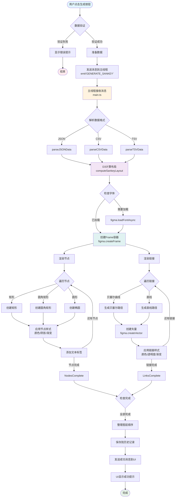

# 🎨 ChartDreamer - Figma 数据可视化插件

> 一款强大的 Figma 插件，用于将数据快速转换为精美的桑基图（Sankey Diagram）

## ✨ 功能特性

- 📊 **智能数据处理**：支持 JSON、CSV、TSV 多种数据格式
- 🎨 **丰富的样式配置**：7种预设配色方案，3种节点形状，多种链接样式
- 🔍 **实时数据验证**：智能错误检测和修复建议
- 💾 **历史记录管理**：自动保存最近10条生成记录，支持一键加载
- ⚡ **性能优化**：防抖处理、React.memo 优化，大数据集警告提示
- 🎯 **用户友好**：设置持久化、加载状态提示、成功/错误反馈

## 🏗️ 技术架构

### 技术栈
- **框架**: Preact + TypeScript
- **构建工具**: [Create Figma Plugin](https://yuanqing.github.io/create-figma-plugin/)
- **布局算法**: D3-sankey
- **代码规范**: ESLint + Prettier
- **UI组件**: @create-figma-plugin/ui

### 数据流程图



## 🚀 快速开始

### 环境要求

- [Node.js](https://nodejs.org) – v22+
- [Figma 桌面客户端](https://figma.com/downloads/)
- npm 或 yarn 包管理器

### 安装依赖

```bash
# 克隆项目
git clone https://github.com/your-username/figma-chartdreamer-plugin.git

# 进入项目目录
cd figma-chartdreamer-plugin

# 安装依赖
npm install
```

### 构建插件

```bash
# 构建插件
npm run build

# 开发模式（自动监听文件变化）
npm run watch
```

### 在 Figma 中安装插件

1. 打开 Figma 桌面客户端
2. 创建或打开一个 Figma 文档
3. 使用快捷键 `Cmd/Ctrl + /` 打开快速操作栏
4. 搜索并运行 `Import plugin from manifest...`
5. 选择项目根目录下的 `manifest.json` 文件
6. 插件安装成功！

## 📖 使用指南

### 基本使用流程

1. **打开插件**: 在 Figma 中右键 → Plugins → ChartDreamer
2. **输入数据**: 在数据输入框中粘贴或输入数据
3. **选择格式**: 选择数据格式（JSON/CSV/TSV）
4. **配置样式**: 调整颜色方案、节点形状、链接样式等
5. **生成图表**: 点击"生成桑基图"按钮
6. **编辑优化**: 在 Figma 中进一步编辑生成的图表

### 数据格式示例

#### JSON 格式
```json
{
  "nodes": [
    {"id": "A", "name": "源节点A"},
    {"id": "B", "name": "目标节点B"}
  ],
  "links": [
    {"source": "A", "target": "B", "value": 10}
  ]
}
```

#### CSV 格式
```csv
source,target,value
源节点A,目标节点B,10
源节点A,目标节点C,20
```

## 🛠️ 开发指南

### 项目结构

```
figma-chartdreamer/
├── src/
│   ├── main.ts              # 主线程代码
│   ├── ui.tsx               # UI线程入口
│   ├── components/          # React组件
│   │   ├── DataInput.tsx    # 数据输入组件
│   │   ├── ChartConfig.tsx  # 配置组件
│   │   └── HistoryPanel.tsx # 历史记录组件
│   ├── utils/              # 工具函数
│   │   ├── sankeyEngine.ts  # D3布局计算
│   │   ├── figmaRenderer.ts # Figma渲染
│   │   ├── validation.ts    # 数据验证
│   │   └── storage.ts       # 存储管理
│   └── types/              # TypeScript类型定义
├── bugfixLog/              # Bug修复记录
├── doc/                    # 项目文档
└── manifest.json           # 插件配置
```

### 常用命令

```bash
# 开发
npm run watch          # 监听模式
npm run build          # 构建生产版本

# 代码质量
npm run lint           # ESLint 检查
npm run format         # Prettier 格式化

# 类型检查
npm run type-check     # TypeScript 类型检查
```

### 调试技巧

1. **控制台调试**: 使用 `console.log` 输出调试信息
2. **查看控制台**: Figma中使用 `Cmd/Ctrl + Option + I` 打开开发者工具
3. **错误处理**: 查看 `bugfixLog/` 目录下的错误记录
4. **自查清单**: 编码后查看 `bugChecklist.md` 进行自查

## 📋 功能路线图

- [x] 第一阶段：项目初始化和环境配置
- [x] 第二阶段：MVP核心功能实现
  - [x] UI组件构建
  - [x] 数据处理逻辑
  - [x] D3集成
  - [x] Figma渲染引擎
  - [x] 样式系统
- [x] 第三阶段：功能打磨和交互优化
  - [x] 智能错误处理
  - [x] 用户体验提升
  - [x] 性能优化
- [ ] 第四阶段：高级功能（计划中）
  - [ ] 更多图表类型
  - [ ] 数据源集成
  - [ ] 协作功能

## 🤝 贡献指南

欢迎提交 Issue 和 Pull Request！

### 开发规范

1. 遵循 ESLint 和 Prettier 配置
2. 使用 TypeScript 严格类型
3. 编写清晰的注释和文档
4. 提交前运行测试和构建

## 📄 许可证

MIT License

## 🙏 致谢

- [Create Figma Plugin](https://yuanqing.github.io/create-figma-plugin/) - 插件框架
- [D3-sankey](https://github.com/d3/d3-sankey) - 桑基图布局算法
- [Figma Plugin API](https://www.figma.com/plugin-docs/) - Figma官方文档

## 📞 联系方式

- 问题反馈：[GitHub Issues](https://github.com/your-username/figma-chartdreamer-plugin/issues)
- 功能建议：[GitHub Discussions](https://github.com/your-username/figma-chartdreamer-plugin/discussions)

---

*Made with ❤️ for Figma Community*
